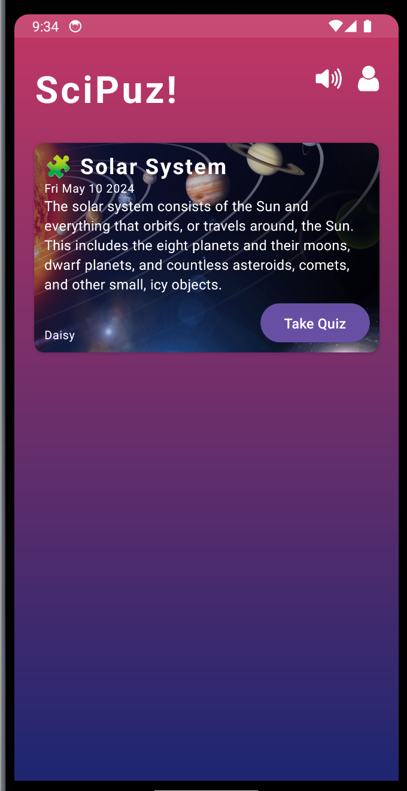
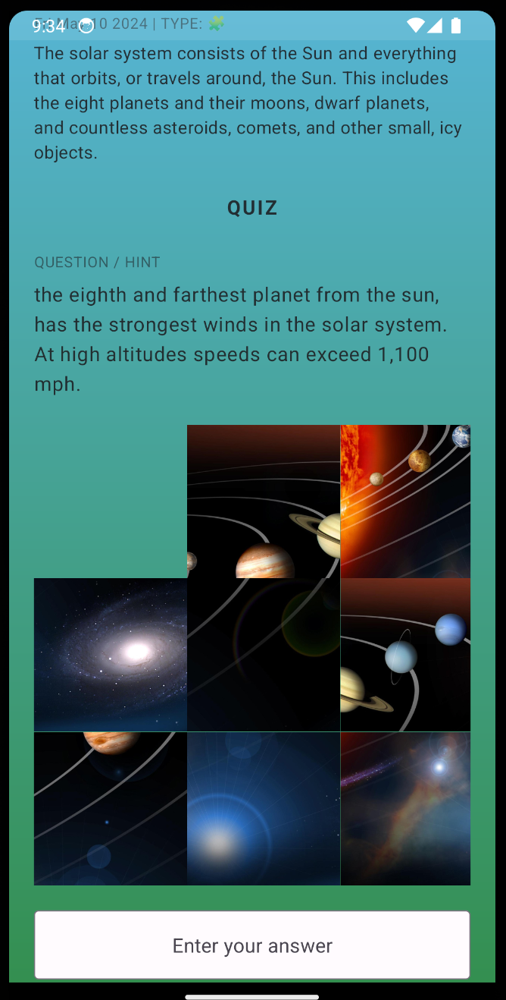

# SciPuz

Welcome to SciPuz! This project is a collection of scientific puzzles and brain teasers designed to challenge and entertain.

## Features

- A wide variety of puzzles covering various scientific disciplines
- Engaging and thought-provoking brain teasers
- Solutions provided for each puzzle
- Regular updates with new puzzles

## Installation

To get started with SciPuz, follow these steps:

1. Clone this repository to your local machine.
2. Install the required dependencies by running `npm install` or `yarn install`.
3. Start the Expo development server by running `expo start`.
4. Open the Expo Go app on your mobile device and scan the QR code displayed in the terminal.

## Usage

Once you have the project set up, you can:

- Browse through the available puzzles.
- Select a puzzle to solve.
- Use the provided solution for reference if needed.

## Contributing

We welcome contributions to SciPuz! If you have a puzzle or brain teaser you'd like to add, please follow these guidelines:

1. Fork this repository.
2. Create a new branch for your puzzle.
3. Add your puzzle to the appropriate category.
4. Submit a pull request.

## License

This project is licensed under the MIT License. See the [LICENSE](LICENSE) file for more information.

## Images

Here are some examples of puzzles from the `public_assets` folder:

Feel free to explore more puzzles in the `public_assets` folder!
